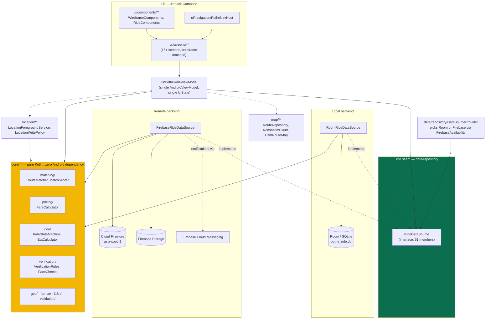

# Architecture

## Layer diagram

## Why this shape

**One interface, two implementations.** `RideDataSource` (`data/repository/RideDataSource.kt`)
is the entire contract the UI depends on — 61 members generated from the original
`RideRepository` class, not hand-transcribed, specifically so nothing was silently dropped.
`RoomRideDataSource` and `FirebaseRideDataSource` both implement it. `DataSourceProvider`
picks one at startup: Firebase when `google-services.json` was present at build time *and*
`FirebaseApp` actually initialises at runtime, Room otherwise. A fresh clone with no
Firebase project still builds and runs against the local store.

**`core/` never imports Android.** Route matching, fare calculation, the ride state
machine, ETA estimation, and the driver-verification approval rules are all plain Kotlin
with no dependency on `android.*` or either data backend. That is what makes them
unit-testable on the JVM with no emulator, and it is also the guarantee that the two
backends cannot silently compute a fare or authorise a transition differently — both call
the same functions.

**The ViewModel cannot tell which backend it has.** `PotheRideViewModel` holds a single
`repo: RideDataSource` and never branches on which implementation it received. This is
deliberate: any code that special-cased "if Firebase, do X" would be exactly the kind of
logic that lets the two backends drift apart.

**Firestore writes go through a transaction where Room didn't need one.**
`data/remote/SeatAccounting.kt` is the one place the two backends genuinely differ in
*behaviour*, not just plumbing: Room is single-writer per device, so a read-then-write of
`availableSeats` could never interleave. Firestore is shared across every device running
the app, and two passengers claiming the last seat in the same second is the ordinary case
at a busy Dhaka pickup point, not an edge case — so seat claims run inside a Firestore
transaction with the availability check *inside* it.

## Package map

| Package | Owns |
|---|---|
| `core/` | Business rules — geometry, pricing, state machine, i18n, verification rules |
| `data/local/` | Room: entities, DAOs, `AppDatabase`, migrations |
| `data/remote/` | Firestore: schema constants, mappers, `FirebaseRideDataSource`, seat transactions |
| `data/repository/` | The `RideDataSource` interface, both implementations' shared notification copy, the backend provider |
| `data/model/` | Read-side DTOs assembled from entities for the UI (`MatchedRide`, `BookingDetail`, …) |
| `location/` | Real GPS: foreground service, write-throttling policy, permission-state modelling |
| `map/` | OSMDroid rendering, the OpenRouteService → GraphHopper → straight-line routing chain, Nominatim search |
| `verification/` | CameraX + ML Kit plumbing for face capture (the *rules* live in `core/verification`) |
| `ui/` | Compose screens, the single `PotheRideViewModel`, navigation, theme/design system |
