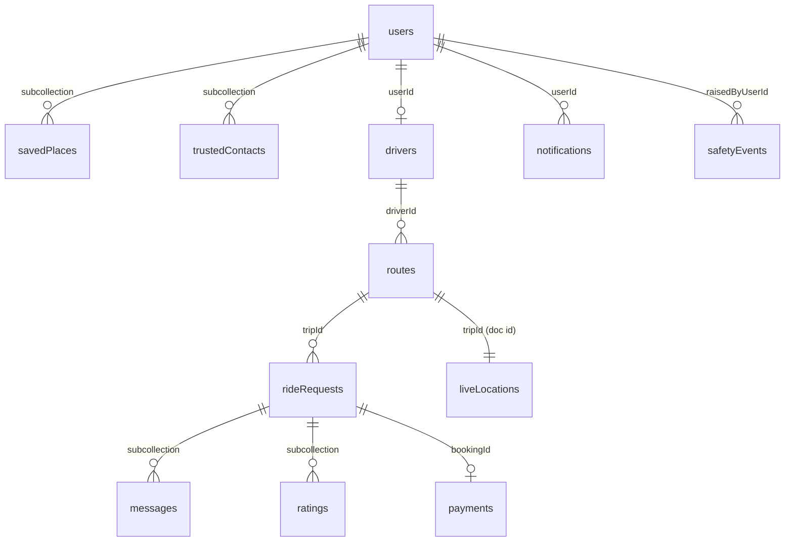

# Firebase Schema

Derived directly from `app/src/main/java/com/potheride/app/data/remote/FirestoreSchema.kt`
and `FirestoreMappers.kt` — every field below exists in that file; nothing here is
aspirational. Project: `pothe-ride-9f8a3`, Firestore in `asia-south1` (Native mode).

## `users/{uid}`

| Field | Type | Notes |
|---|---|---|
| `phone` | string | unique, used to find/create the account |
| `name` | string | |
| `language` | string | `en` \| `bn` |
| `otpVerified` | bool | |
| `photoTint` | int | avatar placeholder colour seed |
| `blocked` | bool | admin-set |
| `role` | string | `passenger` \| `driver` \| `admin` — **security rules read this; a user may never write their own `role`** |
| `createdAt` | long (epoch ms) | |

Subcollections: `savedPlaces/{id}` (`label`, `address`, `lat`, `lng`),
`trustedContacts/{id}` (`name`, `phone`).

## `drivers/{driverId}`

Document id is a generated driver-profile id, **not** the uid — `userId` is the foreign
key back to `users`.

| Field | Type | Notes |
|---|---|---|
| `userId` | string | FK to `users` |
| `licenseNumber` | string | |
| `verified` | bool | display cache only — the real gate is `VerificationRules.canPublishRoute` over `driver_documents` (Room-local; see `docs/upgrade/deps-verification.md`) |
| `ratingSum`, `ratingCount` | int | average computed client-side as `ratingSum / ratingCount` |
| `totalTrips` | int | |
| `vehicles` | array of maps | **nested, not a subcollection** — a vehicle is never read without its driver, and nesting avoids a second document read on every driver lookup. Each entry: `id`, `type`, `plateNumber`, `model`, `colour`, `capacity` |

## `routes/{tripId}`

A published trip.

| Field | Type | Notes |
|---|---|---|
| `driverId`, `vehicleId` | string | |
| `startAddress`, `startLat`, `startLng` | | |
| `endAddress`, `endLat`, `endLng` | | |
| `departureTime` | long | epoch ms |
| `totalSeats`, `availableSeats` | int | `availableSeats` moves only through `SeatAccounting`'s Firestore transaction — see `docs/upgrade/00_PROGRESS.md`'s Level 3b entry |
| `detourKm` | double | driver's tolerance |
| `travelledKm` | double | distance-along-route progress, kept in sync with `liveLocations` |
| `status` | string | `PUBLISHED` \| `IN_PROGRESS` \| `COMPLETED` \| `CANCELLED` |
| `createdAt` | long | |
| `waypoints` | **flat array of doubles** `[lat, lng, lat, lng, …]` | Not a list of `{lat,lng}` maps — halves the field count against Firestore's 20,000-index-entries-per-document limit on a route with a few hundred points. Decoded/encoded by `FirestoreMappers.waypointsFromFlatList` / `waypointsToFlatList` |

**Deliberately absent**: current/live position. See `liveLocations` below — kept in a
separate document so a 5-second GPS write never rewrites the whole polyline.

## `liveLocations/{tripId}`

One document per trip, keyed by trip id (not auto-generated), overwritten on every GPS
fix that passes `LocationWritePolicy`.

| Field | Type | Notes |
|---|---|---|
| `tripId`, `driverId` | string | |
| `lat`, `lng` | double | |
| `travelledKm` | double | distance along the published polyline, not raw GPS — stays correct even if the reported position wobbles off the road |
| `updatedAt` | long | |

## `rideRequests/{bookingId}`

A passenger's booking.

| Field | Type | Notes |
|---|---|---|
| `tripId` | string | |
| `passengerId` | string | |
| `driverId` | string | **denormalised from the route** — Firestore has no joins, so without this a driver would have to read every route they own and fan out a query per route to find their incoming requests |
| `pickupAddress`, `pickupLat`, `pickupLng` | | |
| `dropAddress`, `dropLat`, `dropLng` | | |
| `seatsRequested` | int | |
| `routeOverlapRatio` | double (stored; float in Kotlin) | |
| `sharedDistanceKm`, `detourKm` | double | |
| `farePoisha`, `totalPoisha` | long | 1 poisha = 1/100 taka; money is never a float |
| `pickupEtaMillis`, `dropoffEtaMillis` | long, nullable | |
| `status` | string | `RideState` enum name — `REQUESTED` → … → `PAID`, or `DECLINED`/`CANCELLED` |
| `cancellationReason` | string, nullable | |
| `requestedAt`, `acceptedAt`, `completedAt` | long, nullable | |

Subcollections: `messages/{id}` (`senderId`, `content`, `readAt`, `sentAt`),
`ratings/{id}` (`raterId`, `rateeId`, `stars`, `comment`, `createdAt`).

## `payments/{id}`

| Field | Type | Notes |
|---|---|---|
| `bookingId`, `driverId` | string | |
| `amountPoisha`, `platformFeePoisha`, `driverEarningsPoisha` | long | `amount == fee + earnings`, enforced by `FareCalculator`/`payForBooking`, asserted in `BookingFlowTest` |
| `method` | string | `CASH` \| `BKASH` \| `NAGAD` \| `ROCKET` |
| `status` | string | `PENDING` \| `COMPLETED` — cash settles immediately; every gateway method stays `PENDING` until a real integration confirms it |
| `transactionRef` | string, nullable | |
| `createdAt`, `paidAt` | long, nullable | |

## `notifications/{id}`

| Field | Type | Notes |
|---|---|---|
| `userId` | string | addressee |
| `kind` | string | `NotificationKind` enum — `RIDE_REQUEST`, `REQUEST_ACCEPTED`, `DRIVER_ARRIVING`, `RIDE_COMPLETED`, `CANCELLATION`, `SAFETY`, … |
| `titleEn`, `titleBn`, `bodyEn`, `bodyBn` | string | both languages always populated — see `RideNotifications.kt`, shared by both backends so their copy cannot drift |
| `bookingId` | string, nullable | |
| `readAt` | long, nullable | |
| `createdAt` | long | |

## `safetyEvents/{id}`

| Field | Type | Notes |
|---|---|---|
| `raisedByUserId` | string | |
| `againstUserId` | string, nullable | set for a report, absent for an SOS |
| `bookingId` | string, nullable | |
| `kind` | string | `SOS` \| `REPORT` \| `TRIP_SHARED` \| `BLOCK` |
| `details` | string, nullable | |
| `lat`, `lng` | double, nullable | |
| `resolved` | bool | admin-set |
| `createdAt` | long | |

## Storage paths

From `FirestoreSchema.Storage`:

- `drivers/{uid}/documents/{kind}.{ext}` — NID front/back, licence, registration
- `users/{uid}/profile.{ext}` — profile photo
- `users/{uid}/face/{timestamp}.{ext}` — face verification captures

## Not yet in Firestore

Driver verification documents (`driver_documents` — NID/licence/registration status)
currently live only in the local Room database, not Firestore. See
`docs/upgrade/deps-verification.md` for why, and what moving them would take.
